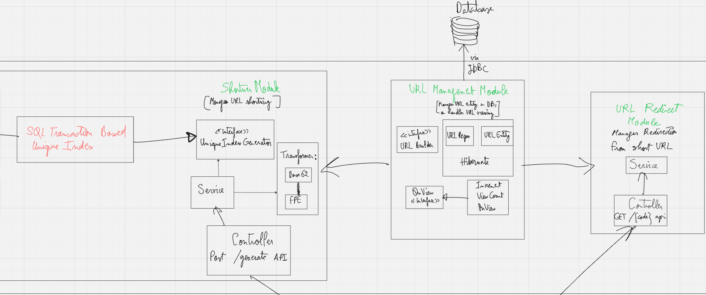

**Url Shortener App**

This URL Shortener Service generates compact aliases (“short codes”) for long URLs. Designed as an MVP.

Key goals (MVP):

* **Simplicity:** Minimal dependencies, straightforward design
* **Extensibility:** Plug in your own IndexGenerator, encoding strategy, Transformers, URL managers…

---

*How to shorten the url*

*Idea 1:* hash the url using a hashing algorithm => rejected

*Limitations:* birthday attack ( 2 hash with same value )

*idea 2:* Use a uniquely incremented index and transform it to base62
*limitations:* Sequential codes may be predictable

*idea 3:* use some kind of encoder like FPE encoder, to avoid reverse engineering the codes
*limitations:* if secret key is compromised, the entire app will be compromised.

*Current choice:* **Increment → Base62 → FPE**

---
*Architecture & Design*
I prepared this component diagram:

[Miro Diagram](https://miro.com/app/board/uXjVIz2BrDc=/?share_link_id=214155488495)

**Index Generation**

* **Current:** Persisted counter in PostgreSQL, atomic increments via SQL transactions and row-level locking (`SqlTransactionBasedUniqueIndexGenerator`).
* **Future:** Redis-based counter or other high-throughput IndexGenerator.

**Short Code Transformer Pipeline**

1. **Base62 encoder** converts the integer index into a URL-safe string.
2. **Format-Preserving Encryption (FPE) layer** to obfuscate sequential patterns.

And to make adding future Transforms Dynamic and seamless I created a Composite Transformer
that offers transformer reordering, adding, removal.

**API Endpoints**

* `POST /api/shorten` : generate a short URL
* `GET /{shortCode}` : redirect to the original URL

---

*Design Principles*

**SOLID Compliance**
by keeping responsibilities focused, composing transformers for easy extension, and relying on clean interfaces and abstractions throughout.

**12 factors compliance**
by using env-based config, treating backing services as attachable resources, and staying stateless and container-ready for seamless scaling and deployment

**Low Coupling & High Cohesion**
* Components communicate via interfaces and Spring DI.
* Transformer stages focus on single concerns (encoding, encryption, formatting).

**Transactional Integrity & Concurrency**

* Scoped `@Transactional` with SERIALIZABLE isolation mode around `nextIndex()` to avoid race conditions.
 
*Docker & Kubernetes*

* **Build:**

  ```bash
  docker build -t url-shortener-dkb:latest .
  ```
* **Run locally:**

  ```bash
  docker run --rm -p 8081:8081 --env-file .env url-shortener-dkb:latest
  ```
* **Kubernetes:** reference `url-shortener-dkb:latest` in your Deployment YAML, inject env via ConfigMap/Secret.

---
 
*Known Limitations*

* **Logging:** Minimal structured logging (no correlation IDs or Logstash integration)
* **Code Coverage:** need more unit and integration tests, plus E2E suite
* **Scalability:** PostgreSQL–based counter may bottleneck under very high write load

---

 *Next Steps*

**CI/CD Pipeline**

* Set up GitLab CI/CD: build, test, security scans → publish Docker images → deploy to Kubernetes (Dev/Prod).

**Testing Strategy**

* Add end-to-end tests (Cypress, Playwright).
* Expand integration tests for URL persistence, transformer behavior, and redirect logic.

* Use Terraform to provision PostgreSQL, spin up K8s clusters (GKE/EKS), and manage DNS, secrets, and monitoring.
**Infrastructure & Scalability**

* Keep backend stateless horizontally scale behind a load balancer.

---

 *Getting Started*

```bash
# Launch PostgreSQL like 
docker run --name urlshortener-postgres \
  -e POSTGRES_USER=postgres \
  -e POSTGRES_PASSWORD=postgres \
  -e POSTGRES_DB=db \
  -p 5432:5432 -d postgres

# Build
docker build -t url-shortener-dkb:latest .
# prepare you .env (check repo's .env)
# Run
docker run --rm -p 8081:8081 --env-file .env url-shortener-dkb:latest

# run tests
 ./gradlew test

# Test
curl -X POST http://localhost:8081/api/shorten \
  -H "Content-Type: application/json" \
  -d '{"url":"https://example.com/very/long/path"}'
```

Omar proposal to DKB.